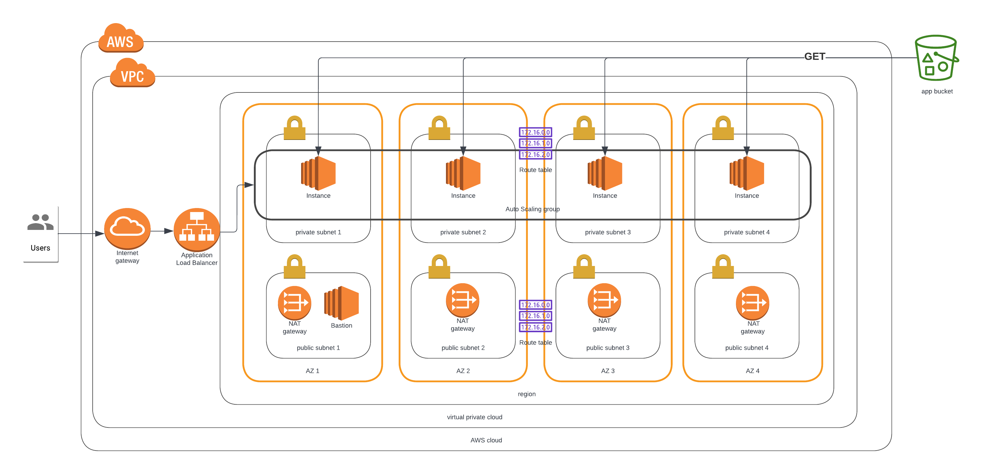

# Deploy a highly-available web app using Cloudformation
This project deploys a highly available web app spanning four availability zones.

## Architecture


## Solution
The solution consists of two parts:
1. The network stack.
2. The application (server) stack

## Deployment Steps
* Configure parameters in `network-parameters.json` and `server-parameters.json`
* Deploy the network stack first.

```
../cfn-helpers/deploy.sh <network-stack-name> network.yml network-parameters.json
```

* Then deploy the application stack.

```
../cfn-helpers/deploy.sh <application-stack-name> servers.yml server-parameters.json
```

Note: AWS CLI must be installed on the machine from where the stack is deployed

